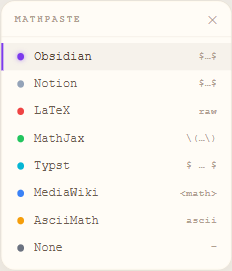

# Math Paste (1.2.0)
Your GO-TO way to translate math from AI Chatbots to online notebooks!

## Demo
Video Demo: [🎥 Watch on YouTube](https://www.youtube.com/watch?v=m4J2uIUJ6IE)

## UI

<p align="center">
  
  &nbsp;&nbsp;&nbsp;
  
</p>

## Table of Contents
- [Demo](#demo)
- [Getting Started](#getting-started)
  - [Chrome Extension](#chrome-extension)
  - [Installation](#installation)
- [Usage](#usage)
- [Supported Formats](#supported-formats)
- [Tech Stack](#tech-stack)

## Getting Started
MathPaste v1.2.0 is available on the Chrome Web Store, or you can install it manually from source.

### Chrome Extension
Available on the Chrome Web Store — search for **Math Paste** or install from source below.

### Installation

1. Clone the repository

```bash
git clone https://github.com/Gallections/MathPaste.git
cd MathPaste
```

2. Install dependencies and build

```bash
npm install
npm run build
```

3. Open `chrome://extensions/` in Chrome and enable **Developer Mode**

4. Click **Load unpacked** and select the `dist/` folder (NOT the project root)

5. The extension icon will appear in your toolbar — you're ready to go!

> **Tip:** Run `npm run dev` during development for automatic rebuilds on save.

## Usage

### User Guide
1. Open ChatGPT, Claude, Copilot, or another supported AI chatbot in Chrome.
2. The MathPaste floating pill appears automatically in the top-right corner.
3. Hover over the pill to open the format selector panel.
4. Select your target format (Obsidian, Notion, LaTeX, etc.).
5. Copy rendered math from the chatbot — MathPaste intercepts the copy and reformats it automatically.
6. Paste into your notebook app. The math will be formatted correctly.
7. Press **`Alt+Shift+M`** to toggle the extension on/off.

### Switching Tabs
MathPaste auto-injects when you switch to a new tab — no refresh needed.

### Common Issues
- If the extension stops responding, reload it from `chrome://extensions/`.
- Refresh the current page after reloading the extension.

## Supported Formats

| Format | Syntax | Target app |
|---|---|---|
| **Obsidian** | `$…$` / `$$…$$` | Obsidian |
| **Notion** | `$…$` | Notion |
| **LaTeX** | raw LaTeX | LaTeX editors |
| **MathJax** | `\(…\)` / `\[…\]` | Web / MathJax |
| **Typst** | `$ … $` | Typst |
| **MediaWiki** | `<math>…</math>` | Wikipedia / MediaWiki |
| **AsciiMath** | ASCII notation | AsciiMath renderers |
| **Markdown** | `$…$` + `**bold**` etc. | Any Markdown editor |
| **None** | — | Passthrough (no conversion) |

## Tech Stack


